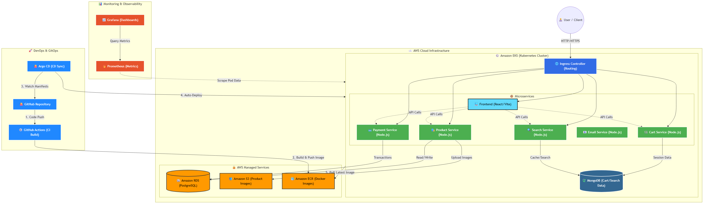

# Microservices E-Commerce Platform on AWS EKS

This repository contains a full-stack, cloud-native E-commerce platform built with a microservices architecture. It demonstrates modern DevOps practices including Infrastructure as Code (IaC), GitOps, CI/CD, and Kubernetes orchestration.

## 🏗️ Architecture Overview

The system is composed of several independent microservices communicating with each other and backed by robust databases. It is designed to be deployed on Amazon EKS (Elastic Kubernetes Service).



### 🚀 Tech Stack
* **Frontend**: React.js with Vite
* **Backend Services**: Node.js & Express.js
  * `product-service`
  * `cart-service`
  * `payment-service`
  * `search-service`
  * `email-service`
* **Databases**: PostgreSQL (Amazon RDS), MongoDB, Amazon S3 (for Image Storage)
* **Infrastructure**: Terraform, Kubernetes, AWS EKS, Ingress NGINX
* **CI/CD & GitOps**: GitHub Actions, Argo CD
* **Observability**: Prometheus & Grafana

---

## 💻 How to Run Locally (Docker Compose)

For local development and testing, you can run the entire stack using Docker Compose.

1. **Clone the repository:**
   ```bash
   git clone https://github.com/Mossab13/Microservices-E-Commerce-eks-project-demo.git
   cd Microservices-E-Commerce-eks-project-demo
   ```

2. **Set up your environment variables:**
   Open the `docker-compose.yml` file and replace the placeholder values (like `YOUR_AWS_ACCESS_KEY_ID`, `YOUR_DB_ENDPOINT`, etc.) with your actual credentials if you want to test cloud features like S3 uploads. Otherwise, local testing works out of the box for most services.

3. **Start the containers:**
   ```bash
   docker-compose up --build
   ```

4. **Access the application:**
   - Frontend is available at: `http://localhost:5173`
   - Backend APIs are available on ports `5001` through `5005`.

---

## 🔑 Default Admin Account

When the database is initialized, a default Admin account is automatically seeded via the `email-service`. You can use this account to access the admin dashboard and manage products.

* **Email:** `admin@example.com`
* **Password:** `12345`

> **Note:** Make sure to change these credentials in a production environment!

---

## ☁️ Deployment to AWS (EKS)

To deploy this project to the cloud, follow these steps:

1. **Infrastructure Provisioning**:
   Navigate to the `terraform/` directory, update your variables, and run:
   ```bash
   terraform init
   terraform apply
   ```
2. **CI/CD Pipeline**:
   Ensure your GitHub Repository Secrets (`AWS_ACCESS_KEY_ID`, `AWS_SECRET_ACCESS_KEY`, etc.) are configured. Any push to the `main` branch will trigger the GitHub Actions workflow (`deploy.yml`) to build Docker images, push them to Amazon ECR, and update the Kubernetes manifests.
3. **GitOps with Argo CD**:
   Argo CD will automatically detect changes in the `kubernetes/` manifests directory and sync the deployments to your EKS cluster.
